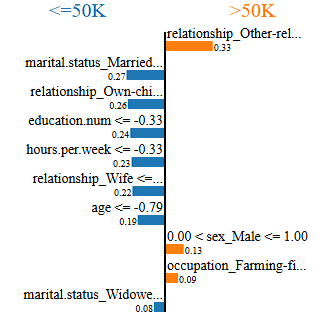
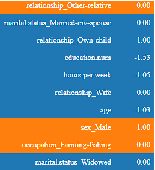

# First Approach: Data Analysis and Machine Learning Workflow

This repository demonstrates the first approach in analyzing and building a machine learning pipeline for the provided dataset. The project includes data preparation, exploratory data analysis, and an initial implementation of a predictive model.

---

## Project Structure

### Notebook
   - Uses libraries like ydata_proffiling to analyse the data.
   - Prepares the dataset by handling missing values, encoding categorical variables, and scaling numerical features.
   - Explores fairness metrics and mitigation strategies using the Fairlearn library.
   - Produces a clean dataset ready for analysis and modeling. 
   - Implements two distinct procedures to address bias, generating synthetic data using the SDV framework to mitigate fairness issues
   - Applies adversarial fairness classification with a custom PyTorch-based model.
   - Evaluates fairness and performance through metrics such as accuracy, demographic parity difference, and selection rate.
   - Uses LIME (Local Interpretable Model-Agnostic Explanations) to explain model predictions and analyze the impact of sensitive features.

---

## Running the Notebook

To run the notebook locally, follow these steps:

Make sure you have downloaded your `adult.csv` dataset.

In this directory, I provided some csv's and .pkl files that have been saved during the process to avoid re-running the whole notebooks.

# Visualizations

